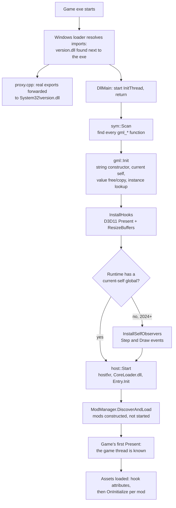
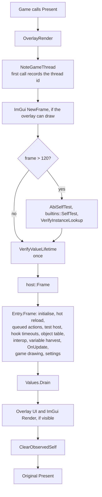

Lodestone is two programs glued together by one C struct. The native half, `version.dll`, is C++ in
`src/`: it gets loaded by the game, finds the game's compiled GML and the runtime helpers it needs, hooks
Direct3D for a per-frame tick and an overlay, and hosts .NET. The managed half, `CoreLoader.dll` in
`managed/CoreLoader/`, is a C# runtime that loads mods, gives them an API, and keeps each one in its own
fault boundary.

Nothing in the native half knows which game it is in. It works on any game compiled with GameMaker's YYC
(the C++ compiler target), and stands down on games that ship VM bytecode instead.

## From process start to a running mod {#startup}



Everything up to `host::Start` happens on the loader's own thread, before the game has drawn anything. Nothing
on that thread calls GML: it only reads memory. The first call into the game happens on the game's own thread,
from inside the Present hook. [Boot sequence](./boot.md) walks through the order and the reasons for it.

The init thread:

```cpp
DWORD WINAPI InitThread(LPVOID) {
    mod::LogInit();
    // ...
    // The exe's .data relocations are applied before imports are resolved, so
    // the YYC registration rows are already valid by the time we get here.
    if (mod::sym::Scan()) {
        // Pure memory reading, so it is safe off the game thread. The first
        // actual GML call happens later, from inside the Present hook.
        mod::gml::Init();
    }
    // d3d11 and dxgi are static imports of this DLL, so they are loaded before
    // DllMain ever runs: no need to wait for them.
    if (!mod::InstallHooks())
        mod::Logf("[!] hook installation failed - overlay will not appear");
    // Runtimes without a current-self global need a live instance from
    // somewhere before any builtin can be called; watching Step events is the
    // generic source. Needs MinHook, so after InstallHooks.
    if (mod::gml::Ready() && !mod::gml::HasSelfGlobal())
        mod::hk::InstallSelfObservers(64);
    // Last, so the symbol table and runtime helpers the C# side asks for are
    // already resolved. Mods' OnInitialize runs later, on the game thread.
    mod::host::Start();
    return 0;
}
```

<small>Source: [src/dllmain.cpp](https://github.com/Forevka/stoneshard-mod/blob/main/src/dllmain.cpp#L12-L41)</small>

## Every frame {#per-frame}

GameMaker runs its game loop on one thread and presents once per frame. Lodestone hooks
`IDXGISwapChain::Present`, so its per-frame code runs on that thread, between the game finishing a frame and the
frame reaching the screen. That is the only place mods, GML calls and the overlay run.



The code of this tick is quoted in [Overlay and frame hook](./overlay.md#frame-tick).

Hooked game scripts are the other way managed code runs: a mod's `[HookBefore]` handler is called from inside
the game's own call to that script, on the same thread. See [Hook engine](./hook-engine.md).

## Native source map {#native-map}

| File | What it does |
|---|---|
| `src/dllmain.cpp` | `DllMain` starts the init thread; `InitThread` runs the startup steps in order. |
| `src/proxy.cpp`, `src/version.def` | The 15 `version.dll` exports the proxy defines (covering what games import), each forwarded to the real DLL in `System32`. |
| `src/symbols.cpp` | Finds every `gml_*` function by scanning the exe's `.data` for YYC's name/function rows. Name lookup, search, and address-to-name (`OwnerOf`). |
| `src/gml.cpp`, `gml.h` | The runtime bridge: the `RValue` layout, string construction, current self, value free/copy, calling scripts and events under a fault guard, GML error capture, self-tests. |
| `src/builtins.cpp` | Finds the runtime's builtin function table (`sprite_exists`, `instance_create_depth`, ...) and calls into it. |
| `src/hookengine.cpp` | Detours on game scripts and events through generated thunks; dispatches to managed handlers; the self observers. |
| `src/hooks.cpp` | Finds and hooks `IDXGISwapChain::Present` and `ResizeBuffers`. |
| `src/overlay.cpp` | ImGui overlay, the window procedure hook (INSERT toggle, pick mode), and `OverlayRender`, the per-frame tick. |
| `src/host/dotnet_host.cpp` | Locates `hostfxr`, starts .NET, binds `Entry.Init`, forwards frames, GUI passes and shutdown. |
| `src/host/core_api.h`, `core_api.cpp` | The `CoreApi` C ABI: one struct of function pointers handed to the managed runtime. |
| `src/paths.cpp` | Where the log and `imgui.ini` go (`<game>\Lodestone\Logs` for an install). |
| `src/log.cpp` | `lodestone.log`, flushed line by line. |

## Managed source map {#managed-map}

| File | What it does |
|---|---|
| `Runtime/Entry.cs` | The `[UnmanagedCallersOnly]` entry points the host binds: `Init`, `Frame`, `Gui`, `Shutdown`, `HookDispatch`. |
| `Runtime/ModManager.cs` | Mod discovery, `ModLoadContext` (one collectible context per mod), hot reload, fault isolation, ownership. |
| `Runtime/InteropGenerator.cs`, `CodeScan.cs`, `VarHarvest.cs` | Generate the per-game interop project; infer script arity from machine code; learn instance variable names. |
| `Native/CoreApi.cs` | Field-for-field mirror of `struct CoreApi`, plus `ManagedExports` and `CoreHookCall`. |
| `Loader.cs` | Holds the `CoreApi` pointer and the game-thread check. |
| `Game.cs` | Calling builtins, scripts and events; the symbol list; queued actions (`RunOnGameThread`); the asset check. |
| `Code.cs` | Read-only views of compiled code: what a function calls, the strings it uses, who calls it. |
| `Hooks.cs` | `Hooks`, `HookCall`, `[HookBefore]` / `[HookAfter]`. |
| `RValue.cs`, `Values.cs` | The GML value type and its lifetime: the per-frame pool, `Keep`, `Free`. |
| `Globals.cs`, `Ds.cs`, `ObjectTable.cs`, `Refs.cs` | Global variables, objects, instances, `ds_map`/`ds_list`, typed script references. |
| `UI.cs`, `Input.cs`, `GameDraw.cs`, `Content.cs` | Overlay widgets, input and pick mode, drawing in the game's GUI layer, added and replaced sprites and sounds. |
| `ModConfig.cs`, `ModSettings.cs` | Per-mod settings files and the settings shown in the in-game MODS window. |
| `TestHost.cs` | The named-pipe test host used by `tools\coreloader.ps1`. |
| `CoreMod.cs` | The `CoreMod` base class and the `CoreModInfo` / `CoreModGame` / `CoreModAnyGame` attributes. |

[Managed runtime](./managed-runtime.md) and [.NET host](./dotnet-host.md) cover these in depth.

## Design principles {#principles}

### Native code is game-agnostic {#game-agnostic}

`src/` holds no game names, no addresses and no offsets that belong to one game. It describes what a YYC
runtime looks like and finds that shape in whatever exe it is loaded into. Game knowledge lives in C# mods,
gated with `[CoreModGame]`. This is what lets one `version.dll` serve Stoneshard, Dwarf Eats Mountain and
other YYC games without a per-game build, and survive game updates that move every function.

### Fail closed {#fail-closed}

When a helper cannot be found or proven, the feature that needs it is turned off and the log says why. Lodestone
never guesses. A wrong guess here is a write to the wrong address in a running game, which corrupts a save or
crashes far from the cause. Examples:

- Fewer than 50 `gml_*` symbols: GML features are off (`symbols.cpp`).
- No consensus on the builtin registrar, or a failed arity check: builtins are unavailable.
- The value free/copy helpers fail their behavioural test: values are leaked instead of freed.
- Until the first Present names the game thread, every GML call is refused.

### Pattern discovery: vote, validate, prove {#vote-validate-prove}

Every runtime helper is found the same way:

1. **Vote across many functions.** Look at a pattern in hundreds or thousands of call sites, and count which
   target they agree on. One site can be misleading; a majority of independent sites rarely is.
2. **Validate the winner structurally.** Check the candidate's own code for the instructions it must contain
   (for example, the string constructor must write the string kind, 1, into offset `0Ch` of the value it is
   handed: `mov dword ptr [reg+0Ch], 1`, bytes `C7 4x 0C 01 00 00 00`, with any base register except `rsp`/`r12`, which would need a SIB byte). A thin margin between
   similar helpers cannot pick the wrong one.
3. **Prove it by behaviour.** Before trusting it with game data, call it on a probe value the loader owns and
   check the result (the value lifetime self-test, the ABI self-test, the builtins self-test).

[Runtime bridge](./runtime-bridge.md), [Builtin functions](./builtins.md) and
[How we found what to hook](./re-toolkit.md) show the pattern applied.
