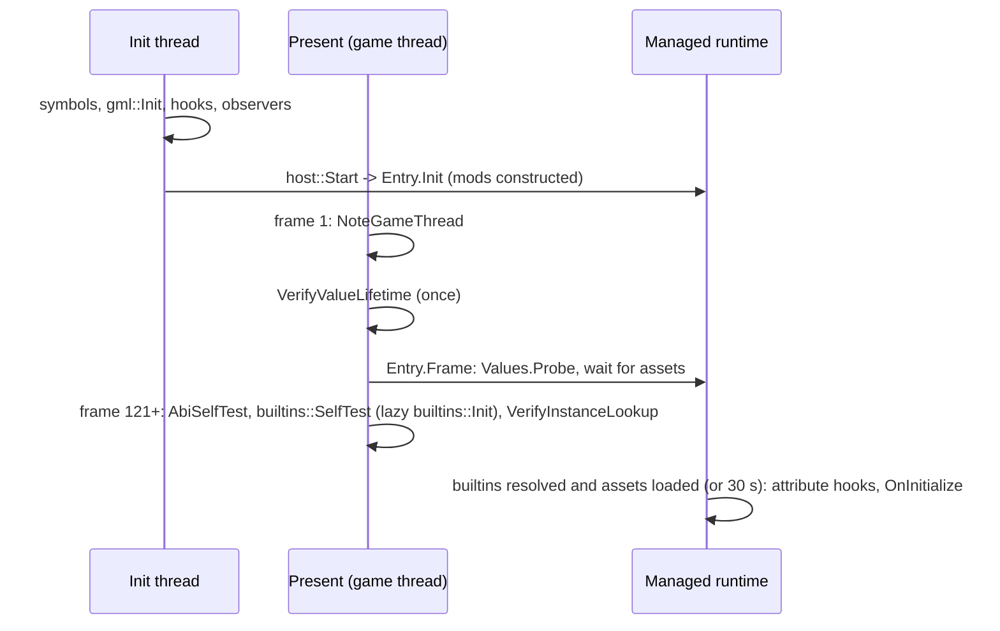

Lodestone has no launcher and patches no files. It is a DLL named `version.dll` placed next to the game's exe.
This page follows it from the moment Windows loads it to the moment the first mod's `OnInitialize` runs.

## The version.dll proxy {#proxy}

GameMaker games import `version.dll` (Stoneshard imports three of its functions). When Windows resolves an
exe's imports it searches the exe's own folder before `System32`, so a DLL of that name next to the exe is
loaded instead of the system one. That is the whole injection mechanism: no launcher, no patched exe, and
removing the file uninstalls it.

The proxy then has to behave exactly like the real `version.dll`, or the game breaks. `src/proxy.cpp` defines
one pass-through per export. Each loads the genuine DLL by absolute path, resolves its counterpart once, and
forwards the call:

```cpp
#define PROXY_FN(ret, name, params, args)                                    \
    extern "C" ret WINAPI Proxy_##name params {                              \
        using fn_t = ret(WINAPI*) params;                                    \
        static std::atomic<fn_t> cached{nullptr};                            \
        fn_t fn = cached.load(std::memory_order_acquire);                    \
        if (!fn) {                                                           \
            fn = reinterpret_cast<fn_t>(ResolveReal(#name));                 \
            cached.store(fn, std::memory_order_release);                     \
        }                                                                    \
        if (!fn) { SetLastError(ERROR_PROC_NOT_FOUND); return (ret)0; }      \
        return fn args;                                                      \
    }
```

<small>Source: [src/proxy.cpp](https://github.com/Forevka/stoneshard-mod/blob/main/src/proxy.cpp#L48-L59)</small>

Two details matter:

- **The real DLL is loaded by absolute path.** `RealDll()` builds `GetSystemDirectoryW() + "\version.dll"`.
  A bare `LoadLibraryW(L"version.dll")` would find the proxy itself first, since it sits next to the exe, and
  recurse.
- **The cached target is atomic.** Exports can be called from any thread. Two threads resolving at once store
  the same pointer, so the race is harmless.

The `Proxy_*` names are mapped onto the real export names in `src/version.def`, which avoids redefining the
SDK's own `dllimport` declarations from `<winver.h>`. The proxy defines 15 exports, not only the three the game
imports, because other DLLs in the process (Steamworks, a Steam emulator, `comctl32`) may import more of them and
would fail to load against a narrower proxy. Current `System32\version.dll` builds export two more
(`VerLanguageNameA` and `VerLanguageNameW`), which the proxy does not forward.

`GetFileVersionInfoByHandle` is undocumented, so it has no public signature to match. The proxy forwards it
as four pointer-sized arguments:

```cpp
// Undocumented, so there is no public signature to match. On x64 the first four
// integer/pointer arguments always arrive in RCX/RDX/R8/R9, so a four-slot
// pass-through forwards it correctly regardless of the true parameter types.
PROXY_FN(UINT_PTR, GetFileVersionInfoByHandle,
         (UINT_PTR a, UINT_PTR b, UINT_PTR c, UINT_PTR d), (a, b, c, d))
```

<small>Source: [src/proxy.cpp](https://github.com/Forevka/stoneshard-mod/blob/main/src/proxy.cpp#L104-L108)</small>

## DllMain does nothing but start a thread {#dllmain}

```cpp
case DLL_PROCESS_ATTACH:
    DisableThreadLibraryCalls(module);
    // Keep the loader lock free: do all real work on our own thread.
    if (HANDLE t = CreateThread(nullptr, 0, InitThread, nullptr, 0, nullptr))
        CloseHandle(t);
    break;
```

<small>Source: [src/dllmain.cpp](https://github.com/Forevka/stoneshard-mod/blob/main/src/dllmain.cpp#L47-L52)</small>

`DllMain` runs under the Windows loader lock. Loading another DLL, starting .NET or waiting on another thread
from there can deadlock the process. So `DllMain` only starts `InitThread` and returns, and all real work
happens on that thread.

Shutdown is the mirror image. On process exit (`reserved != nullptr`) `DllMain` does nothing: every other thread
is already gone, possibly while holding the log's or MinHook's lock, and tearing anything down could only hang
the exit. Mods are shut down earlier, when the game window receives `WM_DESTROY`, which is the last point where
managed code can still run on the game thread. See [.NET host](./dotnet-host.md).

## The init thread {#init-thread}

`InitThread` runs five steps, in an order each step depends on:

| Step | Call | Why it is here |
|---|---|---|
| 1 | `sym::Scan()` | Finds every `gml_*` function in the exe. The exe's `.data` relocations are applied before its imports are resolved, so the YYC registration rows already hold real addresses when this thread starts. See [GML functions](./gml-functions.md). |
| 2 | `gml::Init()` | Finds the runtime helpers (string constructor, current self, value free/copy, instance lookup) by voting over the scripts step 1 found. Pure memory reading, so it is safe off the game thread. Skipped if step 1 failed. See [Runtime bridge](./runtime-bridge.md). |
| 3 | `InstallHooks()` | Hooks `Present` and `ResizeBuffers`. `d3d11` and `dxgi` are static imports of this DLL, so they are loaded before `DllMain` runs and nothing has to wait for them. See [Overlay and frame hook](./overlay.md). |
| 4 | `hk::InstallSelfObservers(64)` | Only on runtimes with no current-self global (2024 and later). Builtins need a live instance as `self`; hooking Step and Draw events supplies one each frame. Needs MinHook, which step 3 initialised. See [Hook engine](./hook-engine.md). |
| 5 | `host::Start()` | Starts .NET and calls `Entry.Init`. Last, so the symbol table and helpers the managed side asks about are already resolved. |

None of these steps calls GML. The game may not have run a single frame yet, and the init thread is not the
game's thread. The first call into the game happens later, from inside `Present`.

## YYC or VM {#yyc-or-vm}

GameMaker has two compile targets. YYC turns GML into C++ and links it into the exe, so every script becomes a
native function with a `gml_*` name. The VM target ships GML as bytecode in `data.win` and interprets it, so the
exe contains no such functions. Lodestone hooks native functions, so it needs YYC.

The symbol scan doubles as the detector: if it finds fewer than 50 symbols (`kMinEntries`), the scan fails. The
floor and the health check are described in [GML functions](./gml-functions.md#health-check).

A failed scan has two very different causes, and they call for different reactions. A game update that changed
the YYC table layout is a loader bug to fix. A VM game is out of scope. `DataWinHasBytecode()` tells them
apart by reading only the chunk headers of `data.win`: a VM build has a non-empty `CODE` chunk, a YYC build has
none or an empty one.

```cpp
if (g_entries.size() < kMinEntries) {
    char buf[200];
    if (DataWinHasBytecode())
        std::snprintf(buf, sizeof(buf),
                      "not a YYC game: data.win holds VM bytecode, and Lodestone needs "
                      "YYC-compiled code (GML features are off)");
    else
        std::snprintf(buf, sizeof(buf),
                      "only %zu symbols resolved (expected >= %zu) - table shape changed?",
                      g_entries.size(), kMinEntries);
    g_health  = buf;
    Logf("[!] symbols: %s", g_health.c_str());
    return false;
}
```

<small>Source: [src/symbols.cpp](https://github.com/Forevka/stoneshard-mod/blob/main/src/symbols.cpp#L179-L192)</small>

On a VM game the loader stands down rather than failing: `gml::Init` is skipped, so the GML bridge reports
unavailable and every GML call is refused. The overlay's Status tab shows the message, and only for the
table-shape case adds that a game update probably changed the layout. Mods that do not need GML can still run.

## Staged readiness {#staged-readiness}

The init thread finishes long before the game is ready to be called. Several things can only happen on the game
thread, or only once the game has run for a while, so the loader brings features up in stages, each one checked
every frame until it succeeds.



### The game thread {#game-thread}

The first thing `OverlayRender` does on every frame is `gml::NoteGameThread()`. The first call records the
thread id. Until then `gml::OnGameThread()` returns false for every thread, so every API call that touches GML
fails closed: there is no game code to call into yet anyway.

```cpp
void NoteGameThread() {
    DWORD expected = 0;
    if (g_gameThread.compare_exchange_strong(expected, GetCurrentThreadId()))
        Logf("gml: game thread is %lu", static_cast<unsigned long>(GetCurrentThreadId()));
}

// Fails closed: until the first Present names the game thread, nothing is
// allowed to touch GML - there is no game code to call into yet anyway.
bool OnGameThread() {
    const DWORD t = g_gameThread.load(std::memory_order_relaxed);
    return t != 0 && t == GetCurrentThreadId();
}
```

<small>Source: [src/gml.cpp](https://github.com/Forevka/stoneshard-mod/blob/main/src/gml.cpp#L453-L464)</small>

### Value lifetime {#value-lifetime}

`gml::VerifyValueLifetime()` runs once, on the first frame with a ready bridge and before any mod code. It builds
a probe string around a static buffer, then checks that the discovered `COPY_RValue` takes a reference and that
`FREE_RValue` releases one, without ever letting the probe's count reach zero. If any step misbehaves, freeing
and copying are disabled and values leak instead. A leak costs memory; a wrong free corrupts the game's heap. The
managed side picks up the verdict with `Values.Probe()` on its first frame. Details are in
[Runtime bridge](./runtime-bridge.md).

### The self-tests, from frame 121 {#self-tests}

From frame 121 on, every frame runs `gml::AbiSelfTest()`, `builtins::SelfTest()` and
`gml::VerifyInstanceLookup()` (the code is quoted in [Overlay and frame hook](./overlay.md#frame-tick)).
Calling a builtin needs a live instance to pass as `self`, even when the builtin ignores it. Waiting 120 frames
lets the game create its first instances and run their events, so the current-self global (older runtimes) or the
self observers (2024 and later) have one to offer. Each test retries on later frames until it has what it needs,
then runs once.

### Builtins, resolved lazily {#builtins-lazy}

The builtin function table is filled in by the runtime during its own startup, so it may still be empty when the
first caller asks. `builtins::Init()` is lazy and safe to call repeatedly. It scans `.text` for the registrar once
(that result is fixed at link time), then re-reads the registrar's globals, at most twice a second, until the
table holds between 500 and 20,000 rows. Once a populated table has been read, any rejection after that is final.
The retry logic is quoted in [Builtin functions](./builtins.md#lazy).

### Waiting for the game's assets {#asset-wait}

The managed runtime constructs mods in `Entry.Init`, but only starts them (attribute hooks, then `OnInitialize`)
from `Entry.Frame`, once the game has loaded its assets:

```csharp
// Mods start once the game has its assets: some games (Stoneshard)
// load sprites, sounds and rooms seconds after the first frame, and a
// sprite added before that would take a slot the game is about to fill.
// A game that never answers still gets its mods after ~30 s, and one
// without a GML bridge (nothing could ever answer) gets them at once.
_startWait ??= System.Diagnostics.Stopwatch.StartNew();
// A check that cannot tell (it faulted) counts as "not yet" until the timeout.
if (Game.IsGmlReady && _startWait.Elapsed < TimeSpan.FromSeconds(30) &&
    !(Game.BuiltinCount > 0 && Game.AssetsLoaded(whenUnsure: false)))
{
    if (!_announcedWait) { _announcedWait = true; Log.Info("waiting for the game's assets before starting mods"); }
    return;
}
```

<small>Source: [managed/CoreLoader/Runtime/Entry.cs](https://github.com/Forevka/stoneshard-mod/blob/main/managed/CoreLoader/Runtime/Entry.cs#L73-L85)</small>

The check itself asks the game whether sprite 0 or room 0 exists:

```csharp
internal static bool AssetsLoaded(bool whenUnsure = true)
{
    try
    {
        return CallBuiltin("sprite_exists", 0).AsBool || CallBuiltin("room_exists", 0).AsBool;
    }
    catch (GmlException)
    {
        return whenUnsure;
    }
}
```

<small>Source: [managed/CoreLoader/Game.cs](https://github.com/Forevka/stoneshard-mod/blob/main/managed/CoreLoader/Game.cs#L233-L243)</small>

The reason is sprite slots. GameMaker hands out asset indices in order. A mod that calls `Content.AddSprite`
before the game has loaded its own sprites takes a slot the game is about to fill, and the two collide. Stoneshard loads its assets about 16 seconds after its first frame; Dwarf Eats Mountain
is ready in under two. The 30-second cap keeps a game that never answers the check from holding mods back forever,
and a game without a GML bridge starts its mods at once, since nothing could ever answer.

While a mod waits, its overlay tab says "Starts once the game has loaded its assets." The log line
`starting mods after N s` marks the moment it ends.
