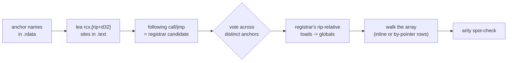

GameMaker's built-in functions (`buffer_create`, `instance_exists`, `variable_instance_get`, `ds_map_*`
and about 2,500 more) are not in the [`gml_*` table](./gml-functions.md). They are C++ functions in the
runner, and the runner registers each one by name into a heap array during startup. Reaching that
array gives the loader the whole GML standard library, including the reflection builtins that read
an instance's variables by name instead of by guessed memory offset. `src/builtins.cpp` finds it.

## The resolution chain {#chain}

No step uses an address. Each one is anchored on a name or on an instruction shape, so a game update
that moves code changes nothing:

1. Find a builtin's name string (such as `"buffer_create"`) in `.rdata`.
2. Find the `lea rcx,[rip+d32]` in `.text` that loads that string.
3. The `call` or `jmp` that follows is the registrar. Repeat for several names and take a vote.
4. Read the registrar's rip-relative loads to find the three globals it maintains: the array pointer,
   the count and the capacity.
5. Walk the array.



## Anchor names {#anchors}

Eleven names, spread across unrelated parts of the runtime (networking, buffers, randomness, JSON,
dates, instances, reflection), so that a vote among them means something:

```cpp
// Spread across different areas of the runtime so a consensus vote is meaningful.
// Wider than strictly necessary: the first live run resolved only 2 of 5, and a
// bigger sample makes the difference between "the pattern changed" and "these
// particular names are awkward" obvious from the log alone.
const char* const kAnchors[] = {
    "network_create_socket", "network_send_udp",  "network_destroy",
    "buffer_create",         "buffer_get_size",   "buffer_delete",
    "random_set_seed",       "json_encode",       "date_get_year",
    "instance_exists",       "variable_instance_get",
};
```

<small>Source: [src/builtins.cpp](https://github.com/Forevka/stoneshard-mod/blob/main/src/builtins.cpp#L63-L72)</small>

`FindAnchorStrings` makes one pass over `.rdata` for all eleven at once. A match must be
NUL-delimited on both sides, so `buffer_create` cannot match inside `buffer_create_from_vertex_buffer`.
Every occurrence is kept, not just the first: several names appear twice in `.rdata` (the log shows
`strings=2`), and only one of those is the registration site.

<small>Source: [src/builtins.cpp](https://github.com/Forevka/stoneshard-mod/blob/main/src/builtins.cpp#L96-L119)</small>

## Registration sites {#registration-sites}

Registering a builtin passes its name in `rcx`, the first argument under the Windows x64 ABI.
`FindRegistrations` makes one pass over `.text` for this shape:

```nasm
48 8D 0D xx xx xx xx    lea  rcx, [rip+d32]   ; d32 -> an anchor's name string
...                                           ; func, argc, flags into rdx, r8, r9
E8 xx xx xx xx          call Builtin_Add      ; within 7..31 bytes of the lea
; or
E9 xx xx xx xx          jmp  Builtin_Add      ; the last registration in a block is a tail call
```

For each `lea` whose target is one of the anchor strings, the first `E8` or `E9` within the next 32
bytes is decoded, and its target counts as a registrar candidate if it lands in `.text`. `E9` counts
as well as `E8` because the compiler turns the last call of a registration block into a tail jump.
The scanner is `FindRegistrations` in
[src/builtins.cpp, lines 121-155](https://github.com/Forevka/stoneshard-mod/blob/main/src/builtins.cpp#L121-L155).

## The vote {#vote}

Each anchor nominates the call targets it reached. The vote counts *distinct anchors*, not sites:
a name that the runtime also references from twenty other places must not outvote a name with a
single registration. The winner must have at least 3 anchors and strictly more than the runner-up.
Otherwise resolution stops and says why.

```cpp
// Tally by DISTINCT anchor, not by site: a name referenced from twenty
// places must not outvote one referenced from a single registration.
std::unordered_map<std::uintptr_t, int> byAnchor;
for (const AnchorResult& a : anchors) {
    // ... (logs each anchor and its candidates)
    for (const auto& t : a.targets) {
        // ...
        ++byAnchor[t.first];
    }
}

std::uintptr_t agreed = 0;
int votes = 0, runnerUp = 0;
for (const auto& c : byAnchor) {
    if (c.second > votes)      { runnerUp = votes; agreed = c.first; votes = c.second; }
    else if (c.second > runnerUp) runnerUp = c.second;
}

const int total = static_cast<int>(std::size(kAnchors));
if (!agreed || votes < 3 || votes <= runnerUp) {
```

<small>Source: [src/builtins.cpp](https://github.com/Forevka/stoneshard-mod/blob/main/src/builtins.cpp#L302-L323)</small>

In both test games all eleven anchors agree, with no runner-up:

```
builtins: registrar 00007FF76572D2C0 (11/11 anchors agree, runner-up 0)
```

That Stoneshard address is image base + `0x529D2C0`, which is `0x14529D2C0` at the exe's
preferred base: the same address the offline `tools/re/builtins.py` uses as its default.

## Diagnostic logging {#logging}

Every anchor is logged with how many strings, `lea` sites and candidates it found:

```
builtins:   anchor buffer_create            strings=2 lea=1 candidates=1
builtins:       -> 00007FF76572D2C0 (1 site)
```

This is deliberate. The first live run reported only "anchors found 2, votes 2", which could not tell
a changed instruction pattern from a couple of awkward names. With per-anchor counts, a broken
pattern (every anchor at `lea=0`) and a bad sample (a few anchors at `candidates=0`) look different
in the log alone, without a debugger. The reasoning is recorded in the comment at
[src/builtins.cpp, lines 84-94](https://github.com/Forevka/stoneshard-mod/blob/main/src/builtins.cpp#L84-L94).

## Reading the registrar's globals {#globals}

The registrar appends to the array, so it reads three adjacent `.data` globals: the array pointer
(qword), the count at `+8` (dword) and the capacity at `+0xC` (dword). Which register each load uses
changed between runtimes: Stoneshard's registrar reads the count into `eax`, the 2024 runtime's reads
it into `ecx` and the capacity into `eax`. So `ExtractGlobals` assumes no encoding. It decodes every
rip-relative `mov` in the first `0x200` bytes of the registrar:

```nasm
[REX] 8B /r   mod=00 rm=101        mov r32/r64, [rip+d32]
48 8B 05 xx xx xx xx               mov rax, [rip+d32]     ; REX.W: a qword load
8B 0D xx xx xx xx                  mov ecx, [rip+d32]     ; no REX.W: a dword load
```

It keeps the ones whose target is in `.data`, splits them into qword and dword loads, and picks the
qword global whose `+8` is also loaded as a dword. That pair (pointer, then count) is the
registry's header. The window is a whole `0x200` bytes because the array pointer is only read at the
far end of the function, not in its prologue. See `ExtractGlobals` in
[src/builtins.cpp, lines 157-212](https://github.com/Forevka/stoneshard-mod/blob/main/src/builtins.cpp#L157-L212).

## Two row layouts {#layouts}

The registry row changed shape between runtimes. Both are understood:

```cpp
#pragma pack(push, 1)
struct RFunctionInline {    // older runtimes (Stoneshard): name stored inline
    char     name[0x40];
    TRoutine fn;
    int32_t  argc;          // -1 == variadic
    int32_t  id;
};
struct RFunctionRef {       // 2024+ runtimes: name by pointer
    const char* name;
    TRoutine    fn;
    int32_t     argc;
    int32_t     pad;
};
#pragma pack(pop)
static_assert(sizeof(RFunctionInline) == 0x50, "inline RFunction must be 80 bytes");
static_assert(sizeof(RFunctionRef) == 0x18, "pointer RFunction must be 24 bytes");
```

<small>Source: [src/builtins.cpp](https://github.com/Forevka/stoneshard-mod/blob/main/src/builtins.cpp#L37-L52)</small>

The loader does not pick a layout by version number, because nothing reliable in the image says
which runtime it is. `DetectLayout` reads the first 16 rows both ways and keeps the reading under
which *every* probed row has a printable name, a function pointer in `.text`, and an `argc` between
-1 and 63. Reading a garbage name pointer under the by-pointer layout could fault, so that check runs
under SEH (`SafePrintableName`). If neither reading is clean, the layout is "not recognised" and
resolution fails for good.

<small>Source: [src/builtins.cpp](https://github.com/Forevka/stoneshard-mod/blob/main/src/builtins.cpp#L232-L257)</small>

| Game | Layout | Usable rows |
|---|---|---|
| Stoneshard | inline (80 B) | 2,532 of 2,535 |
| Dwarf Eats Mountain Demo (2024.14) | by-pointer (24 B) | 2,861 of 2,861 |

A row is skipped (not fatal) if its own name is unprintable or its function is outside `.text`.

## Lazy resolution and retries {#lazy}

The array is filled while the runner starts, after `version.dll` has loaded, so resolution is lazy:
`Init()` runs on the first `builtins::Find` or `builtins::Call`, and on every frame after frame 120,
where the overlay's per-frame tick calls `builtins::SelfTest()`. The registrar scan runs once (it is
deterministic: if it failed, it fails forever), and only reading the globals is retried, at most
twice a second, until the table looks populated:

```cpp
// Before the runner has registered its builtins the table is empty or
// half-built. Look again at most twice a second rather than every call,
// so an early caller neither spins nor floods the log.
const DWORD now = GetTickCount();
if (g_tried && now - g_lastTry < 500) return false;
g_tried   = true;
g_lastTry = now;

const void* table = *g_pArray;
const int   n     = *g_pCount;
if (!table || n < 500 || n > 20000) {
```

<small>Source: [src/builtins.cpp](https://github.com/Forevka/stoneshard-mod/blob/main/src/builtins.cpp#L432-L442)</small>

The `500..20000` window is "a GameMaker runtime's worth of builtins": fewer means the runner is still
registering, more means the count global is not what it appears to be. Once a populated table is
seen, any rejection (unknown layout, failed arity check) is final, since retrying would only log the
same failure forever.

## Arity spot-check {#arity}

"The function pointer is in `.text`" is a weak signal: any offset error in the row layout could still
pass it. The argument count is a much stronger one, because a misread row gives a nonsense arity.
After the map is built, five builtins with distinctive arities must match exactly:

```cpp
// Arity spot-check: a much stronger correctness signal than "the pointer is in .text".
struct ArityCheck { const char* name; int argc; };
const ArityCheck kArity[] = {
    {"network_create_socket", 1}, {"network_send_udp", 5}, {"buffer_copy", 5},
    {"date_create_datetime", 6},  {"buffer_get_size", 1},
};
```

<small>Source: [src/builtins.cpp](https://github.com/Forevka/stoneshard-mod/blob/main/src/builtins.cpp#L74-L79)</small>

One mismatch clears the map and disables builtins. Calling a builtin through a misread row would
crash the game, so a missing feature is the better outcome.

## The builtin ABI {#abi}

Builtins and compiled scripts use different calling conventions, and confusing them crashes:

```cpp
// Builtins use a DIFFERENT ABI from YYC scripts:
//     void TRoutine(RValue* result, CInstance* self, CInstance* other,
//                   int argc, RValue* args)
// The result is the FIRST parameter and `args` is a CONTIGUOUS array, not an array of
// pointers. Passing the script-style layout dereferences argument values as pointers
// and crashes, so this must never route through gml::CallAs.
```

<small>Source: [src/builtins.h](https://github.com/Forevka/stoneshard-mod/blob/main/src/builtins.h#L42-L47)</small>

| | Builtin (`TRoutine`) | Script (`gml_Script_*`) |
|---|---|---|
| Signature | `void (RValue* result, self, other, int argc, RValue* args)` | `RValue* (self, other, RValue* result, int argc, RValue** args)` |
| Result | first parameter | third parameter, and returned |
| Arguments | contiguous `RValue[argc]` | array of `RValue*` |

`builtins::Call` checks `argc` against the registered arity (unless the builtin is variadic, -1),
resets the result to `undefined`, and runs the call under SEH with an `ErrorProbe`, so a failing
builtin is logged with the GML error text and returns false instead of taking down the game.

<small>Source: [src/builtins.cpp](https://github.com/Forevka/stoneshard-mod/blob/main/src/builtins.cpp#L525-L550)</small>

Once the table is ready and the game has an instance to lend as `self`, the frame loop runs a
three-call self-test, once: `buffer_create(64, 1, 1)`, then
`buffer_get_size` on the result must be exactly 64, then `random_get_seed`. It passes the buffer
value back unchanged, because older runtimes return a numeric index and 2024+ runtimes a typed handle
(kind 15). See [the runtime bridge](./runtime-bridge.md) for the self-tests as a whole.

<small>Source: [src/builtins.cpp](https://github.com/Forevka/stoneshard-mod/blob/main/src/builtins.cpp#L622-L665)</small>

## The registry index {#registry-index}

The loader keeps the rows in registry order as well (`g_byIndex`), behind `builtins::NameAt(index)`
and the CoreApi entry `BuiltinNameAt`. It exists because compiled GML calls many builtins not by
address but through one runner helper that takes the builtin's *registry index*, loaded from a global
the runner fills at startup. The managed code scanner (`Code.cs`, behind the Console's `code` and
`callers` commands and the Inspector) recognises that shape and names the builtin:

```csharp
// YYC calls most builtins through one runner helper that takes the
// builtin's position in the runner's registry as its 5th argument, loaded
// from a global the runner fills at startup:
//     mov  r32, [rip+global]     ; the registry index
//     mov  [rsp+20h], r32        ; 5th argument
//     ...  call helper
// Returns the registry index when such a load starts at b[i], else -1.
```

<small>Source: [managed/CoreLoader/Code.cs](https://github.com/Forevka/stoneshard-mod/blob/main/managed/CoreLoader/Code.cs#L133-L139)</small>

Without the index, a function that calls `instance_exists` this way would show no call to it at all.

## The sticky array-error flag {#array-error-flag}

One runtime behaviour needed special handling. GameMaker's array helpers report an out-of-range index
by setting a global byte and returning; the caller tests the byte and raises the GML error. Nothing
ever clears it, because a real array error ends the game. When a loader guard swallows such an error,
the byte stays set, and the *next* array access anywhere in the game raises the game's modal error
box with the loader's stale index and size.

```cpp
// with our stale index and size. Both builtins compile to
//   call <array helper>
//   cmp  byte ptr [rip+flag], 0
//   je   ok
//   ...  lea rcx, "array_get :: Index [%d] out of range [%d]"
// so the byte is the one compared just before that message is loaded.
```

<small>Source: [src/builtins.cpp](https://github.com/Forevka/stoneshard-mod/blob/main/src/builtins.cpp#L342-L353)</small>

`ArrayErrorFlagIn` follows a leading `jmp rel32` thunk if the builtin has one, then scans its first
`0x200` bytes for:

```nasm
80 3D xx xx xx xx 00    cmp  byte ptr [rip+d32], 0   ; d32 -> a .data byte
...                                                  ; within 0x30 bytes:
48/4C 8D /r xx xx xx xx lea  r64, [rip+d32]          ; -> "<name> :: ... out of range ..."
```

The candidate must be confirmed twice before it is used: `array_get` and `array_set` must name the
same byte, and that byte must hold 0 or 1 right now (no array error is pending while the loader
starts). After that, every guarded call (`gml::ErrorProbe`) records the byte before the call, and if
the call failed and the byte went from 0 to 1, clears it. A byte that was already set belongs to the
game's own code (a GML `try`/`catch` around a bad index), so it is left alone.

```cpp
void ErrorProbe::Failed() {
    // Only a byte this call set: one already set before it was left by the
    // game's own code (a GML try/catch around a bad index), not ours to hide.
    if (arrayErrorBefore_ == 0 && builtins::ArrayErrorFlag() == 1) {
        builtins::ClearArrayErrorFlag();
        Logf("gml: cleared the runtime's array error flag the failed call left set");
    }
}
```

<small>Source: [src/gml.cpp](https://github.com/Forevka/stoneshard-mod/blob/main/src/gml.cpp#L887-L894)</small>

If the flag cannot be found, the loader logs a warning and carries on: the cost is only that a failed
array access made through the loader may be reported by the game later.

## The offline twin {#offline-twin}

`tools/re/builtins.py` extracts the same registrations from the exe on disk, by a different route:
it takes the registrar's address (default: Stoneshard's `0x14529d2c0`), finds every `call` and `jmp`
to it with the cached xref index, disassembles backwards from each site with Capstone, and tracks
`rcx`, `rdx`, `r8` and `r9` to recover the name, function, argument count and flag of each
registration. The result is cached as `builtin_table.json`, which the Ghidra export uses to label
builtin call sites (see the [reverse-engineering toolkit](./re-toolkit.md)).

```python
"""Extract every Builtin_Add(name, func, nargs, flag) registration statically.

builtins.py [--exe <game.exe>] [<Builtin_Add address, hex>]
"""
# ...
# Address of the runner's Builtin_Add in the game under study, as the first argument
# (hex). The default is Stoneshard's; find another game's from its registration calls.
BUILTIN_ADD = int(sys.argv[1], 16) if len(sys.argv) > 1 else 0x14529d2c0
```

<small>Source: [tools/re/builtins.py](https://github.com/Forevka/stoneshard-mod/blob/main/tools/re/builtins.py#L1-L10)</small>

`--exe` (or `RE_GAME_EXE`) picks the game; `gamepath.py` removes it from `argv` before the script
reads its positional address. For a game other than Stoneshard, pass that game's registrar address
in hex, for example the one the loader logs as `builtins: registrar ...` minus the image base plus
`0x140000000`.
