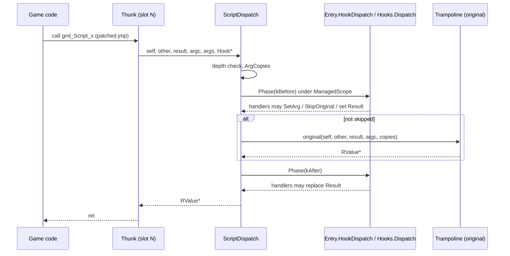

`Hooks.Before("scr_get_XP", ...)` in a mod ends up as a MinHook detour on the native function `gml_Script_scr_get_XP`. Between the two sits a small engine in `src/hookengine.cpp`. It emits a 64-byte thunk per hooked function, routes every call through one shared dispatcher, and hands the call to the managed side only when a mod is listening.

This page walks through that path from the machine code up to `Hooks.Dispatch`.

## Why thunks instead of plain detours {#why-thunks}

MinHook redirects a function to a detour you supply, but the detour receives only the original arguments. It is not told which hook fired. To hook an arbitrary number of game functions with plain MinHook you would need one distinct detour function per target, usually a fixed pool of template instantiations, and the pool size would cap how many functions mods can hook.

The engine solves this the other way round. Each hooked target gets a tiny thunk, emitted at runtime, that carries a pointer to its own `Hook` record into **one** shared dispatcher:

```cpp
// MinHook needs a distinct detour function per target and gives it no context,
// which would force a fixed number of template-instantiated slots. Here each
// hooked target gets a small thunk emitted at runtime that
// carries a pointer to its own record into ONE shared dispatcher, so the number
// of hooks is bounded only by the thunk arena.
```

<small>Source: [src/hookengine.h](https://github.com/Forevka/stoneshard-mod/blob/main/src/hookengine.h#L11-L15)</small>

There are two calling conventions to cover, because YYC compiles two kinds of function:

| Kind | Native signature | Symbols |
|---|---|---|
| Script | `RValue* f(self, other, result, argc, args**)` | `gml_Script_*` |
| Event | `void f(self, other)` | `gml_Object_*`, `gml_RoomCC_*`, `gml_GlobalScript_*` |

See [GML functions](./gml-functions.md) for where these names come from.

## The thunk arena {#arena}

All thunks live in one executable block allocated with `VirtualAlloc` on first use:

| Region | Size | Contents |
|---|---|---|
| Header | 64 bytes | Two `UNWIND_INFO` records: the framed one (script thunks) at offset 0, the leaf one (event thunks) at offset 16 |
| Slots | 4096 x 64 bytes | One thunk per slot, padded with `0xCC` (`int3`) |

Slots are handed out in order and never reused. Disabling a hook detaches the detour but keeps its thunk, because a call that is already inside it must be able to finish. Hooking the same target twice returns the same id, so the 4096 slots bound the number of *distinct* functions hooked in one process, not the number of subscriptions.

### Unwind data {#unwind-data}

GML exceptions are C++ throws. When a script throws, the game's own `try`/`catch` sits somewhere above the hooked call, and the Windows unwinder has to walk through the thunk's frame to reach it. Code without registered unwind data breaks that walk. So the arena registers one `RUNTIME_FUNCTION` per slot with `RtlAddFunctionTable`, up front, and points each slot at the right unwind record when its thunk is emitted.

```cpp
// Script thunk: `sub rsp,38h` is its whole prologue (4 bytes).
//   Version 1, no flags | prolog 4 | 1 code | no frame register
//   code: at offset 4, UWOP_ALLOC_SMALL (2) with OpInfo (0x38-8)/8 = 6
const unsigned char framed[] = {0x01, 0x04, 0x01, 0x00, 0x04, 0x62, 0x00, 0x00};
// Event thunk never touches rsp: a leaf as far as unwinding is concerned.
const unsigned char leaf[]   = {0x01, 0x00, 0x00, 0x00};
```

<small>Source: [src/hookengine.cpp](https://github.com/Forevka/stoneshard-mod/blob/main/src/hookengine.cpp#L66-L71)</small>

The byte `0x62` packs `OpInfo = 6` in the high nibble and `UWOP_ALLOC_SMALL = 2` in the low one: an allocation of `6 * 8 + 8 = 0x38` bytes, exactly what the script thunk's `sub rsp, 38h` does. If `RtlAddFunctionTable` fails, the engine frees the arena and refuses to hook anything, rather than install thunks that would break unwinding.

### Write protection {#write-protection}

The arena is allocated read-write-execute, filled, and then flipped to `PAGE_EXECUTE_READ`. It becomes writable again only for the few microseconds a thunk is being emitted, through a scope guard:

```cpp
// Emission window. The arena stays executable throughout: other threads may be
// running earlier thunks on the same pages at that very moment.
struct WritableArena {
    WritableArena()  { DWORD old = 0; VirtualProtect(g_arena, kArenaSize, PAGE_EXECUTE_READWRITE, &old); }
    ~WritableArena() { DWORD old = 0; VirtualProtect(g_arena, kArenaSize, PAGE_EXECUTE_READ, &old); }
```

<small>Source: [src/hookengine.cpp](https://github.com/Forevka/stoneshard-mod/blob/main/src/hookengine.cpp#L99-L103)</small>

A permanently RWX block is what code-integrity mitigations and anti-cheat software look for, and a stray write could land in it. The emission window flips to RWX rather than RW because earlier thunks on the same pages may be executing on another thread at that moment.

## Emitting a thunk {#emit-thunk}

`EmitThunk` writes raw x64 into the next slot. The two kinds differ because of how many arguments the dispatcher needs:

```cpp
if (h->kind == Kind::Script) {
    bytes({0x48, 0x83, 0xEC, 0x38});               // sub rsp, 38h
    bytes({0x48, 0x8B, 0x44, 0x24, 0x60});         // mov rax, [rsp+60h]  (caller's arg 5)
    bytes({0x48, 0x89, 0x44, 0x24, 0x20});         // mov [rsp+20h], rax  (our arg 5)
    bytes({0x48, 0xB8}); imm64(h);                 // mov rax, hook
    bytes({0x48, 0x89, 0x44, 0x24, 0x28});         // mov [rsp+28h], rax  (our arg 6)
    bytes({0x48, 0xB8}); imm64(reinterpret_cast<void*>(&ScriptDispatch));
    bytes({0xFF, 0xD0});                           // call rax
    bytes({0x48, 0x83, 0xC4, 0x38});               // add rsp, 38h
    bytes({0xC3});                                 // ret
    g_pdata[slot].UnwindData = kUnwindFramed;
} else {
    bytes({0x49, 0xB8}); imm64(h);                 // mov r8, hook
    bytes({0x48, 0xB8}); imm64(reinterpret_cast<void*>(&EventDispatch));
    bytes({0xFF, 0xE0});                           // jmp rax
    g_pdata[slot].UnwindData = kUnwindLeaf;
}
```

<small>Source: [src/hookengine.cpp](https://github.com/Forevka/stoneshard-mod/blob/main/src/hookengine.cpp#L295-L311)</small>

### Event thunk: a register and a tail jump {#event-thunk}

An event takes `(self, other)` in `rcx` and `rdx`. Under the Windows x64 convention the third argument goes in `r8`, which the event does not use, so the thunk loads the hook record there and jumps to `EventDispatch(self, other, hook)`. It never touches `rsp`. `EventDispatch` returns straight to the game's caller, and the unwinder sees the thunk as a leaf.

### Script thunk: the stack shuffle {#script-thunk}

A script takes five arguments. The first four (`self`, `other`, `result`, `argc`) are in `rcx`, `rdx`, `r8` and `r9`, and the fifth (`args`) is on the caller's stack. `ScriptDispatch` takes a sixth parameter, the hook record, and a sixth argument has to go on the stack too. A tail jump cannot do that: there is no room above the return address that belongs to us. So the script thunk builds a real frame:

```nasm
sub  rsp, 38h          ; 0x38 = shadow space (0x20) + two stack args (0x10) + 8 to keep rsp 16-byte aligned
mov  rax, [rsp+60h]    ; caller's 5th arg: 0x38 (our frame) + 8 (return address) + 0x20 (shadow) = 0x60
mov  [rsp+20h], rax    ; becomes ScriptDispatch's 5th arg
mov  rax, imm64        ; the Hook* for this slot
mov  [rsp+28h], rax    ; ScriptDispatch's 6th arg
mov  rax, imm64        ; &ScriptDispatch
call rax
add  rsp, 38h
ret                    ; rax still holds ScriptDispatch's RValue* result
```

Registers `rcx` to `r9` pass through untouched, so `ScriptDispatch` receives `(self, other, result, argc, args, hook)`. Because the frame allocates stack, this is the thunk that needs the framed unwind record.

## Installing a detour {#install}

`InstallImpl` turns a target address into a hook id:

1. If the target is already hooked, return its id. Hooking it as the other kind is refused, because the thunk would read garbage registers.
2. Allocate a `Hook` record in a `std::deque` (stable addresses: the thunk holds a raw pointer to it) and emit its thunk.
3. `MH_CreateHook(target, thunk, &h.original)`. MinHook patches the target's first instructions with a jump to the thunk and returns a **trampoline**: the displaced instructions followed by a jump back into the target. Calling the trampoline runs the original function without passing through the detour.
4. Enable the detour, either at once with `MH_EnableHook` or queued with `MH_QueueEnableHook` for a batch (see [self observers](#self-observers)).
5. Log `hooks: #<id> script|event <symbol name>`.

If any step fails, the record and its slot are given back and the call returns -1. `MH_ERROR_ALREADY_CREATED` means some other MinHook user in the process already owns the target, and the engine cannot share it.

### What the API accepts {#install-restrictions}

Mods do not pass addresses to `hook_install`. The managed side resolves a symbol name, and the native entry point still checks the address it receives:

```cpp
std::int32_t ApiHookInstall(void* target, std::int32_t kind) {
    if (kind != 0 && kind != 1) return -1;
    const char* name = sym::OwnerOf(target);
    if (!name || sym::Find(name) != target) {
        Logf("[!] core api: hook_install(%p) is not the start of a gml_* function; refused", target);
        return -1;
    }
    // Scripts take (self, other, result, argc, args); object events, room
    // creation code and 2.3+ global-script initialisers take (self, other).
    const bool script = std::strncmp(name, "gml_Script_", 11) == 0;
    const bool event  = std::strncmp(name, "gml_Object_", 11) == 0 || std::strncmp(name, "gml_RoomCC_", 11) == 0 ||
                        std::strncmp(name, "gml_GlobalScript_", 17) == 0;
    if ((kind == 0 && !script) || (kind == 1 && !event)) {
        Logf("[!] core api: hook_install(%s) as %s does not match its calling convention; refused",
             name, kind == 0 ? "a script" : "an event");
        return -1;
    }
    return hk::Install(target, kind == 0 ? hk::Kind::Script : hk::Kind::Event);
}
```

<small>Source: [src/host/core_api.cpp](https://github.com/Forevka/stoneshard-mod/blob/main/src/host/core_api.cpp#L226-L243)</small>

Two failure modes are ruled out here. An address in the middle of a function would have MinHook patch the middle of live code. A script hooked as an event, or the reverse, would make the thunk hand the dispatcher whatever happens to be in `r8`, `r9` and the stack as `result` and `args`, and a handler would then write through those pointers. The kind is therefore derived from the symbol's prefix, never trusted from the caller.

## Dispatching a script call {#script-dispatch}



The core of `ScriptDispatch`:

```cpp
auto* managed = h->managed.load(std::memory_order_acquire)
                    ? g_managed.load(std::memory_order_acquire) : nullptr;
// Only when mods listen, and only where copies can be made and released.
std::optional<ArgCopies> copies;
if (managed && gml::CanCopyValues() && gml::CanFreeValues()) {
    copies.emplace(args, argc);
    args = copies->Pointers();
}
Call c{self, other, result, args, argc, kBefore, 0, h->id};
ActiveScope active(&c);
Phase(&c, managed);

gml::RValue* ret = RunScriptOriginal(h, &c, managed);

c.phase = kAfter;
Phase(&c, managed);
return ret;
```

<small>Source: [src/hookengine.cpp](https://github.com/Forevka/stoneshard-mod/blob/main/src/hookengine.cpp#L239-L255)</small>

The `Call` record built here has a fixed layout shared with the managed `CoreHookCall` struct. `core_api.cpp` checks this with `static_assert`s on its size and field offsets, and the struct is append-only.

### Managed or not {#managed-flag}

Each hook has an atomic `managed` flag, and the engine holds one global managed dispatcher pointer. Both must be set for `Phase` to cross into .NET. A hook that is attached but not managed (a self observer no mod subscribes to) only pays for the thunk, a depth counter and an atomic load before the original runs. The global pointer is cleared at shutdown, so from then on hooks only run originals (see [.NET host](./dotnet-host.md)).

### Argument copies {#arg-copies}

YYC passes arguments as **pointers**: to the caller's temporaries, to its variables, or to static constants it emits for literals. If a handler replaced an argument in place, it would change the caller's variable, or rewrite the constant for every later call from that site. A doubling multiplier would compound on each call.

```cpp
// Private copies of a script's arguments. YYC passes argument POINTERS - to
// the caller's temporaries, its variables, or static constants for literals -
// so a handler replacing an argument in place would change the caller's
// state, or rewrite the constant for every later call of that site (a
// multiplier would compound). With managed handlers attached the original is
// called with copies instead: a replaced argument reaches it, and nothing
// else. Released however the call ends.
```

<small>Source: [src/hookengine.cpp](https://github.com/Forevka/stoneshard-mod/blob/main/src/hookengine.cpp#L161-L167)</small>

`ArgCopies` copies each argument with the game's own copy helper (up to 8 inline, more on the heap) and frees the copies in its destructor, however the call ends. Copies are made only when mods listen and only when the copy and free helpers were proven to work (see [runtime bridge](./runtime-bridge.md)). On a runtime without them, `HookCall.SetArg` writes into the caller's slot and does not release the old value.

### The after phase always runs {#after-always-runs}

```cpp
gml::RValue* RunScriptOriginal(Hook* h, Call* c, ManagedDispatch managed) {
    gml::RValue* ret = c->result;
    try {
        if (!c->skip)
            ret = reinterpret_cast<ScriptFn>(h->original)(c->self, c->other, c->result, c->argc, c->args);
    } catch (...) {
        c->phase = kAfter;
        Phase(c, managed);
        throw;
    }
    return ret;
}
```

<small>Source: [src/hookengine.cpp](https://github.com/Forevka/stoneshard-mod/blob/main/src/hookengine.cpp#L204-L215)</small>

A Before handler can set `skip`, and then the original is not called at all and the result slot is returned as the handler left it. If the original throws a GML exception, the `catch (...)` gives After handlers their turn and rethrows. The game's own handler further up still receives the exception, and a mod that pairs a Before with an After (start a timer, stop it) never sees an unbalanced pair.

### Depth cap {#depth-cap}

A thread-local counter tracks nested dispatches. Past 256 levels, which means a handler calling the function it hooks or two hooks calling each other, handlers are skipped and the original runs bare. A runaway recursion then stays the game's own, instead of one multiplied by several managed frames per level. The first time this happens, the engine logs a single warning.

### Phase and ManagedScope {#phase}

```cpp
void Phase(Call* c, ManagedDispatch managed) {
    if (!managed) return;
    gml::ManagedScope inManaged;   // no GML exception may cross these frames
    managed(c);
}
```

<small>Source: [src/hookengine.cpp](https://github.com/Forevka/stoneshard-mod/blob/main/src/hookengine.cpp#L112-L116)</small>

`ManagedScope` marks .NET frames on this thread's stack. While one is present, every guarded call into the game catches GML exceptions itself, because a C++ exception unwinding through .NET frames kills the process. Outside it, inside a hook dispatch with only native frames in between, a GML exception is left for the game's own `catch`. The [runtime bridge](./runtime-bridge.md) page covers the guard filter.

### Events {#event-dispatch}

`EventDispatch` follows the same shape without arguments, a result or copies. It also calls `gml::NoteSelf(self)` first. An object event's `self` is always a live instance, which the loader needs on runtimes without a current-self global (see [self observers](#self-observers)). Scripts do not feed it, because a script's `self` can be a struct (a bound method, or `with` over a struct) rather than an instance.

## Calling the original again {#call-original}

`HookCall.CallOriginal()` reruns the unhooked script with the same self, other and current arguments:

```cpp
if (!h || h->kind != Kind::Script || !h->original) return false;

// The trampoline IS the original: calling it skips our detour, so no
// handler sees this call. CallAs supplies the same fault guard as any
// other call into the game.
return gml::CallAs(h->original, result, call->args, call->argc, call->self, call->other);
```

<small>Source: [src/hookengine.cpp](https://github.com/Forevka/stoneshard-mod/blob/main/src/hookengine.cpp#L428-L433)</small>

Before this, `CallOriginal` checks `IsActive(call)`. Each `ScriptDispatch` pushes its `Call` onto a thread-local chain for its duration, and a call record that is not in that chain is refused. A handler that stored the `HookCall` and used it after returning would otherwise hand the engine a pointer into a dead stack frame.

## The managed side {#managed-side}

`managed/CoreLoader/Hooks.cs` owns the subscriber lists. Native code knows only hook ids and the managed flag.

### Subscribing {#subscribing}

```csharp
string full = Resolve(symbol, out nint target, out int kind);
int id = Loader.Api->HookInstall(target, kind);
if (id < 0) throw new GmlException($"could not hook {full} (see the loader log)");

var sub = new Subscription { Handler = handler, After = after, Owner = owner, Order = _order++ };
var list = ById.TryGetValue(id, out var existing) ? existing : Array.Empty<Subscription>();
Names[id] = full;
ById[id] = [.. list, sub];
if (list.Length == 0) { Loader.Api->HookEnable(id, 1); Loader.Api->HookSetManaged(id, 1); }
return new HookHandle(id, sub);
```

<small>Source: [managed/CoreLoader/Hooks.cs](https://github.com/Forevka/stoneshard-mod/blob/main/managed/CoreLoader/Hooks.cs#L323-L332)</small>

- `Resolve` accepts a full `gml_*` name or a bare script name, which gets `gml_Script_` prepended, and picks the kind from the prefix, the same rule the native side enforces.
- The lists are **copy-on-write** arrays. A hooked Step event can dispatch thousands of times a frame, so dispatch iterates the array as it is with no per-call snapshot. Adding or removing replaces the array, so a handler that subscribes or unsubscribes mid-dispatch leaves the array being iterated untouched.
- The **first** subscriber enables the detour and turns on managed dispatch. When the **last** one leaves, `Release` turns both off, so the function runs at full speed again. `Disable` keeps the detour attached if the loader itself still uses it (`nativeUsers`).
- Each subscription records its owning mod (`ModManager.OwnerOf(handler)`). On unload, fault or hot reload, `RemoveOwner` drops that mod's subscriptions and releases hooks left empty. See [ownership](../modding/concepts.md#ownership).

### Dispatch per owning mod {#dispatch}

The native dispatcher pointer is `Entry.HookDispatch`, an `[UnmanagedCallersOnly]` method that wraps `Hooks.Dispatch` in a catch-all, because an exception escaping such a method terminates the process. `Hooks.Dispatch` then:

- reads the subscription array for `c->HookId` and runs the handlers whose phase matches, in subscription order;
- skips handlers whose mod is faulted;
- sets `ModManager.Current` to the handler's owner for the duration of the call, so anything the handler registers, such as a hook added lazily from inside a hook, belongs to that mod and not to whichever mod's code made the game run this function;
- catches an exception from a handler and faults only its mod (see [faults](../modding/concepts.md#faults)).

### Attribute hooks {#attribute-hooks}

`[HookBefore("...")]` and `[HookAfter("...")]` methods are subscribed by `Hooks.AttachAttributes` when a mod starts, before its `OnInitialize` runs, so `OnInitialize` can rely on them being live. Static methods may live on any type in the mod's assembly, instance methods only on the mod class, and every hook method must have the shape `void M(HookCall call)`.

For using hooks from a mod, see the [hooks cookbook](../modding/cookbook/hooks.md) and [hook arguments](../modding/concepts.md#hook-arguments).

## Self observers on 2024 runtimes {#self-observers}

Builtins need a plausible `self` instance even when they never look at it. Older runtimes keep the current instance in a global the loader finds by pattern. The 2024 runtime has no such global (see [runtime differences](./runtime-differences.md)), so the loader watches the game run code instead:

```cpp
for (const sym::Entry& e : sym::All()) {
    if (steps >= maxEvents && draws >= maxEvents) break;
    if (std::strncmp(e.name, "gml_Object_", 11) != 0) continue;
    const bool isStep = std::strstr(e.name, "_Step_") != nullptr;
    const bool isDraw = !isStep && std::strstr(e.name, "_Draw_") != nullptr;
    if (!isStep && !isDraw) continue;
    if ((isStep && steps >= maxEvents) || (isDraw && draws >= maxEvents)) continue;
    const int id = InstallImpl(e.func, Kind::Event, true);
    if (id < 0) continue;
    {
        std::lock_guard<std::mutex> lock(g_lock);
        ++g_hooks[id].nativeUsers;
    }
    if (isStep) ++steps; else ++draws;
}
const MH_STATUS applied = MH_ApplyQueued();
```

<small>Source: [src/hookengine.cpp](https://github.com/Forevka/stoneshard-mod/blob/main/src/hookengine.cpp#L441-L456)</small>

- The init thread calls `InstallSelfObservers(64)` only when the GML bridge is ready and the runtime has no self global. It runs after `InstallHooks`, because it needs MinHook initialised.
- Up to 64 Step and 64 Draw events across many objects are hooked. Whichever objects are alive in the current room keep supplying a fresh instance every frame. Draw events are included because some games' long-lived controllers only draw.
- The detours are queued and applied together with one `MH_ApplyQueued`. Each `MH_EnableHook` freezes and resumes every thread in the process, and doing that 128 times at startup would be needlessly slow.
- These hooks have `nativeUsers > 0`, so when a mod's last subscription on one of them goes away, the detour stays attached and only managed dispatch is switched off.
- Each observed event calls `NoteSelf`. Once per frame, after the loader's own work, the overlay calls `gml::ClearObservedSelf()`. What `CurrentSelf()` hands out was therefore seen running during the current frame, never an instance destroyed by a room change long ago (see [overlay](./overlay.md)).
